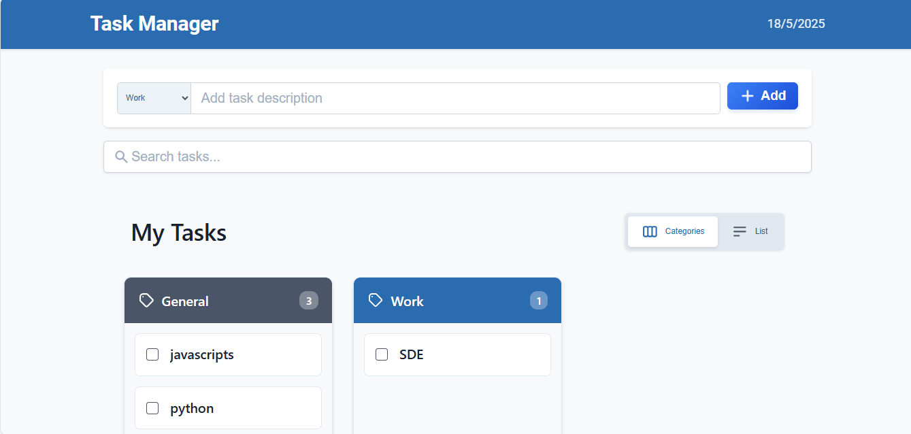

# Task Manager - React Todo List Application

A modern, feature-rich task management application built with React that allows you to organize tasks by categories.



## Features

- ✅ Create and manage tasks with categories
- 🔍 Search functionality to quickly find tasks
- 📋 Two view modes: Category view and List view
- 🎨 Visual task categorization with color coding
- ✓ Mark tasks as complete with visual indicators
- 🗑️ Delete tasks you no longer need
- 💾 Tasks are saved in local storage, persisting between sessions

## Implementation Steps

### 1. Component Structure

The application is built with the following React components:

- `App.js` - Main component managing state and data flow
- `header.js` - Displays the application title
- `additem.js` - Form for adding new tasks with categories
- `searchitem.js` - Search functionality for filtering tasks
- `main.js` - Displays tasks in either category or list view
- `footer.js` - Displays the copyright information

### 2. State Management

The application uses React's useState hook to manage the following state:

```javascript
// Tasks array stored in local storage
const [items, setItems] = useState(
  JSON.parse(localStorage.getItem('list')) || []
)
// New task input
const [newItems, setNewItems] = useState('')
// Search query
const [search, setSearch] = useState('')
```

### 3. Task Management Functions

The core functionality is implemented with these functions:

```javascript
// Toggle task completion status
const click = (id) => {
  const listItems = items.map((item) => 
    item.id === id ? {...item, checked: !item.checked} : item
  )
  setItems(listItems)
  localStorage.setItem("list", JSON.stringify(listItems))
}

// Delete a task
const del = (id) => {
  const listItems = items.filter(item => item.id !== id)
  setItems(listItems)
  localStorage.setItem("list", JSON.stringify(listItems))
}

// Add a new task
const addItems = (item) => {
  if (!item || !item.trim()) return;
  
  const id = items.length ? items[items.length-1].id + 1 : 1
  const addNewItems = {id, checked: false, item: item.trim()}
  const listItems = [...items, addNewItems]
  setItems(listItems)
  localStorage.setItem("list", JSON.stringify(listItems))
}
```

### 4. Task Categorization

Tasks are categorized by using a prefix format: `"Category: Task description"`. 

The application supports the following categories by default:
- General
- Work
- Home
- Study
- Personal
- Shopping
- Health

The category is extracted using this function:

```javascript
const getTaskCategory = (task) => {
  if (!task || typeof task !== 'string') return 'General';
  const match = task.match(/^([^:]+):/);
  return match ? match[1].trim() : 'General';
};
```

### 5. How to Use

1. **Adding a Task**:
   - Select a category from the dropdown
   - Enter your task description
   - Click "Add" or press Enter

2. **Completing a Task**:
   - Click the checkbox next to a task to mark it as complete

3. **Deleting a Task**:
   - Click the delete button (trash icon) to remove a task

4. **Searching Tasks**:
   - Type in the search box to filter tasks by their content

5. **Switching Views**:
   - Toggle between "Categories" and "List" views using the buttons at the top

### 6. Running the Application

In the project directory, you can run:

#### `npm start`

Runs the app in the development mode.\
Open [http://localhost:3000](http://localhost:3000) to view it in your browser.

#### `npm run build`

Builds the app for production to the `build` folder.\
It correctly bundles React in production mode and optimizes the build for the best performance.

## Getting Started with Create React App

This project was bootstrapped with [Create React App](https://github.com/facebook/create-react-app).

## Available Scripts

In the project directory, you can run:

### `npm start`

Runs the app in the development mode.\
Open [http://localhost:3000](http://localhost:3000) to view it in your browser.

The page will reload when you make changes.\
You may also see any lint errors in the console.

### `npm test`

Launches the test runner in the interactive watch mode.\
See the section about [running tests](https://facebook.github.io/create-react-app/docs/running-tests) for more information.

### `npm run build`

Builds the app for production to the `build` folder.\
It correctly bundles React in production mode and optimizes the build for the best performance.

The build is minified and the filenames include the hashes.\
Your app is ready to be deployed!

See the section about [deployment](https://facebook.github.io/create-react-app/docs/deployment) for more information.

### `npm run eject`

**Note: this is a one-way operation. Once you `eject`, you can't go back!**

If you aren't satisfied with the build tool and configuration choices, you can `eject` at any time. This command will remove the single build dependency from your project.

Instead, it will copy all the configuration files and the transitive dependencies (webpack, Babel, ESLint, etc) right into your project so you have full control over them. All of the commands except `eject` will still work, but they will point to the copied scripts so you can tweak them. At this point you're on your own.

You don't have to ever use `eject`. The curated feature set is suitable for small and middle deployments, and you shouldn't feel obligated to use this feature. However we understand that this tool wouldn't be useful if you couldn't customize it when you are ready for it.

## Learn More

You can learn more in the [Create React App documentation](https://facebook.github.io/create-react-app/docs/getting-started).

To learn React, check out the [React documentation](https://reactjs.org/).

### Code Splitting

This section has moved here: [https://facebook.github.io/create-react-app/docs/code-splitting](https://facebook.github.io/create-react-app/docs/code-splitting)

### Analyzing the Bundle Size

This section has moved here: [https://facebook.github.io/create-react-app/docs/analyzing-the-bundle-size](https://facebook.github.io/create-react-app/docs/analyzing-the-bundle-size)

### Making a Progressive Web App

This section has moved here: [https://facebook.github.io/create-react-app/docs/making-a-progressive-web-app](https://facebook.github.io/create-react-app/docs/making-a-progressive-web-app)

### Advanced Configuration

This section has moved here: [https://facebook.github.io/create-react-app/docs/advanced-configuration](https://facebook.github.io/create-react-app/docs/advanced-configuration)

### Deployment

This section has moved here: [https://facebook.github.io/create-react-app/docs/deployment](https://facebook.github.io/create-react-app/docs/deployment)

### `npm run build` fails to minify

This section has moved here: [https://facebook.github.io/create-react-app/docs/troubleshooting#npm-run-build-fails-to-minify](https://facebook.github.io/create-react-app/docs/troubleshooting#npm-run-build-fails-to-minify)
